# Table of Contents

1.  [Cyberpunk](#org6394d10)
    1.  [ArtStation - Cyberpunk Busy Street , Donglu Yu](#orga81b288)
    2.  [ArtStation - Barcelona Smoke & Neons: Sant Pau i La Sagrada Familia, Guillem H. Pongiluppi](#org1c7cec3)
    3.  [ArtStation - Cyberpunk Alley Environment, James Atkinson](#org212f640):city:modern:
2.  [City](#orgaeffeac)
    1.  [theartofmany: Artist: 手指断了 a Title: Hi ChengDu &#x2026; - Our Sci-Fi Future](#org3808648)
    2.  [ArtStation - Half-Life - (February work), Wadim Kashin](#org30c66d6)
3.  [Science Fiction](#org1eeca42)
    1.  [ArtStation - xcom , Eddie Del Rio](#org11d0220)
4.  [Environments](#orgcee721e)
    1.  [ArtStation - Subterra, Wadim Kashin](#org7968902)
    2.  [ArtStation - Barcelona Aftermath: El Palau de la Música, Guillem H. Pongiluppi](#orge4fedf0):Concept:
    3.  [ArtStation - Environment concepts , Grafit Studio](#org4c3d184)
    4.  [ArtStation - Rift Nightmare Tide environment concept, Herman Ng](#org9c5c134)
    5.  [ArtStation - Destiny 2 Forsaken: Hellrise Canyon, Richard Rude](#org1b7d733)
5.  [Mountain & spring](#orgcc4c012)
    1.  [ArtStation - Torrent of Gelion, Ferdinand Ladera](#org08773c1)
6.  [Fantasy](#org9ab02dd)
    1.  [ArtStation - The Mountain Kingdom, Max Bedulenko](#org64fd226):mountain:Environments:
7.  [Sky & sea](#orga4b7c0a)
    1.  [ArtStation - More animation environments, Ned Rogers](#org09d01a9)
    2.  [ArtStation - Arrival, James Ross McNab](#org0109e08)
8.  [Cave & Rock](#org65b9bf1)
    1.  [ArtStation - 24h Speed Environment, Robert Berg](#orgeff83c6)
    2.  [ArtStation - Mystical Woods, Ferdinand Ladera](#org0a2fbe6)

# Cyberpunk

## [ArtStation - Cyberpunk Busy Street , Donglu Yu](https://www.artstation.com/artwork/KqZ1y)

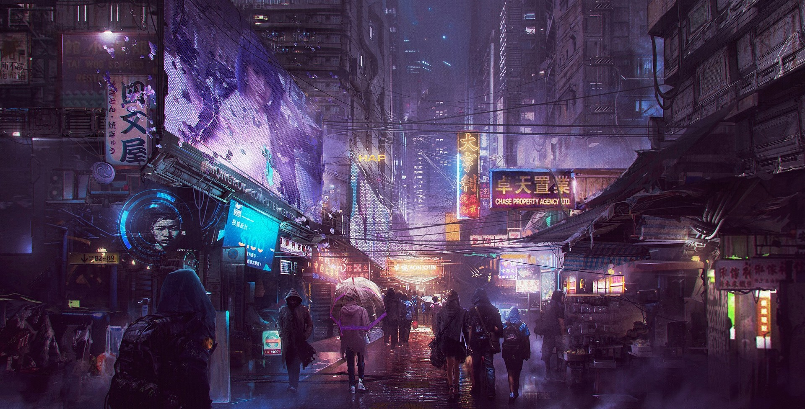

## ❤ Love [ArtStation - Barcelona Smoke & Neons: Sant Pau i La Sagrada Familia, Guillem H. Pongiluppi](https://www.artstation.com/artwork/Xag90)

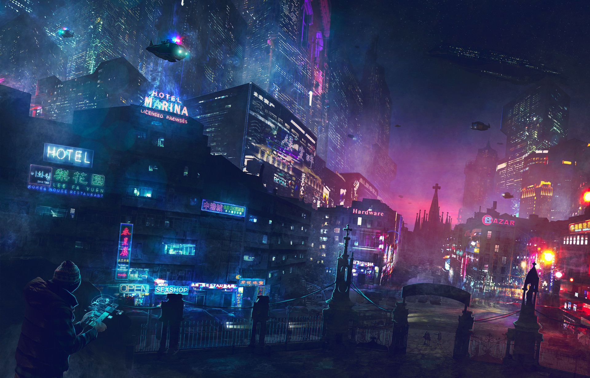

## [ArtStation - Cyberpunk Alley Environment, James Atkinson](https://www.artstation.com/artwork/Z5gJ5N)     :city:modern:

# City

## [theartofmany: Artist: 手指断了 a Title: Hi ChengDu &#x2026; - Our Sci-Fi Future](https://the-binary-tomorrow.tumblr.com/post/173454677836/theartofmany-artist-%E6%89%8B%E6%8C%87%E6%96%AD%E4%BA%86-a-title-hi-chengdu)

## [ArtStation - Half-Life - (February work), Wadim Kashin](https://www.artstation.com/artwork/EaaRn)

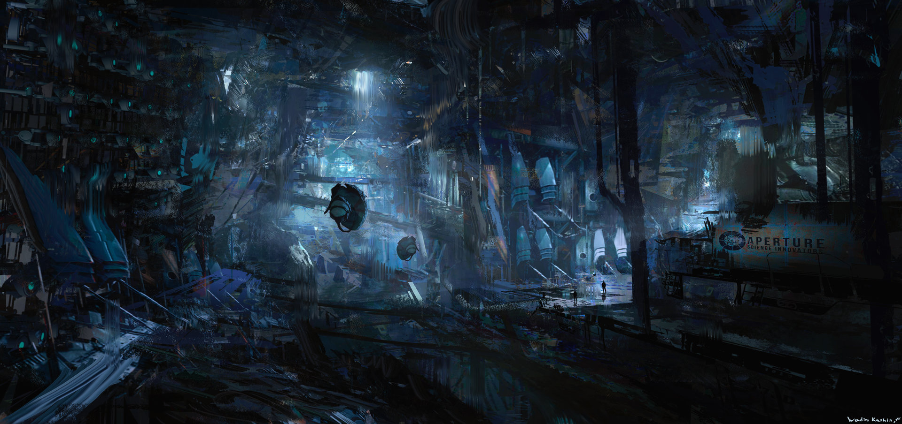

# Science Fiction

## [ArtStation - xcom , Eddie Del Rio](https://www.artstation.com/artwork/NKYRD)

# Environments

## [ArtStation - Subterra, Wadim Kashin](https://www.artstation.com/artwork/xdR3O)

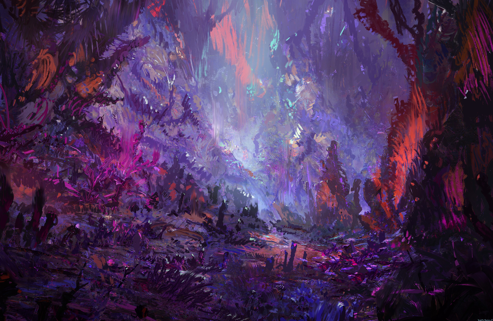

## [ArtStation - Barcelona Aftermath: El Palau de la Música, Guillem H. Pongiluppi](https://www.artstation.com/artwork/3ENAg)     :Concept:

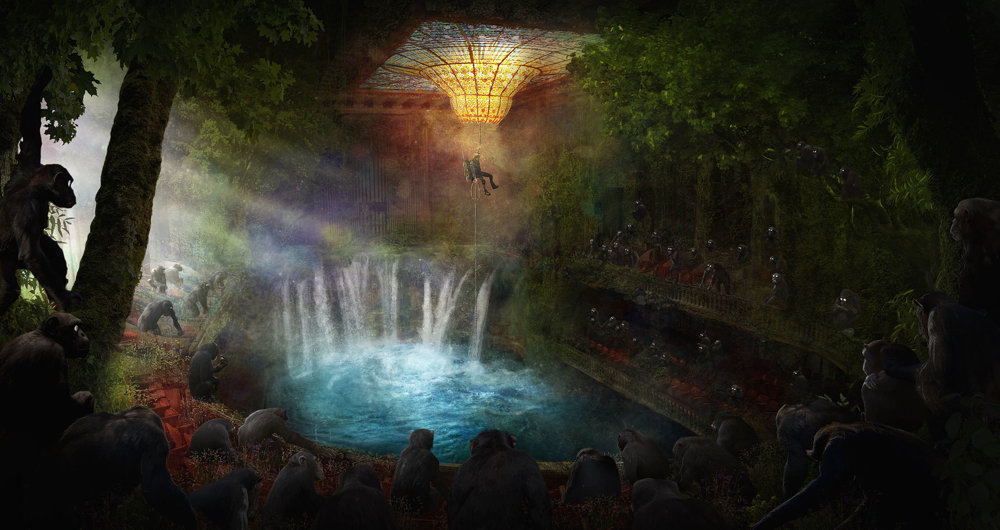

## [ArtStation - Environment concepts , Grafit Studio](https://www.artstation.com/artwork/vwAn3)

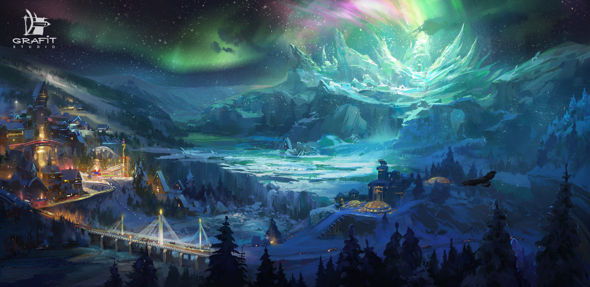

1.  Next

    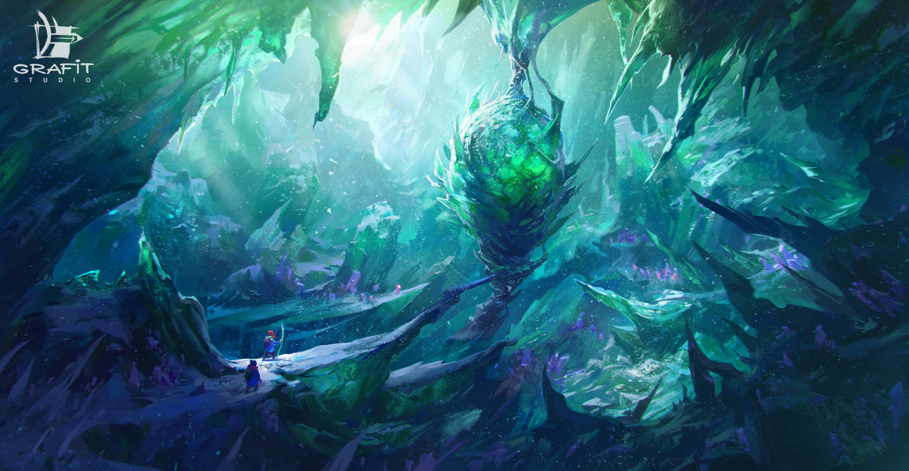

## [ArtStation - Rift Nightmare Tide environment concept, Herman Ng](https://www.artstation.com/artwork/0ZrWV)

## ❤ Love [ArtStation - Destiny 2 Forsaken: Hellrise Canyon, Richard Rude](https://www.artstation.com/artwork/b6e0n)

# Mountain & spring

## [ArtStation - Torrent of Gelion, Ferdinand Ladera](https://www.artstation.com/artwork/985Ga)

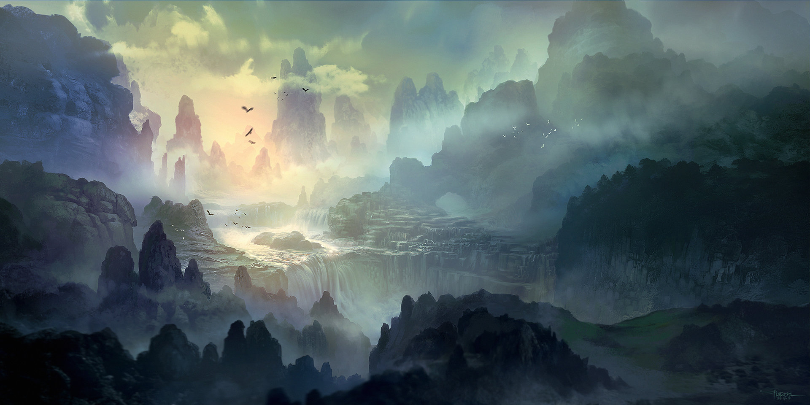

# Fantasy

## [ArtStation - The Mountain Kingdom, Max Bedulenko](https://www.artstation.com/artwork/L4n65)     :mountain:Environments:

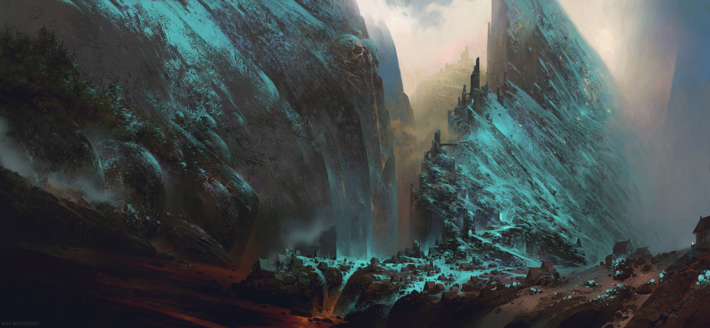

# Sky & sea

## [ArtStation - More animation environments, Ned Rogers](https://www.artstation.com/artwork/aRB4kX)

## [ArtStation - Arrival, James Ross McNab](https://www.artstation.com/artwork/yPzZ5)

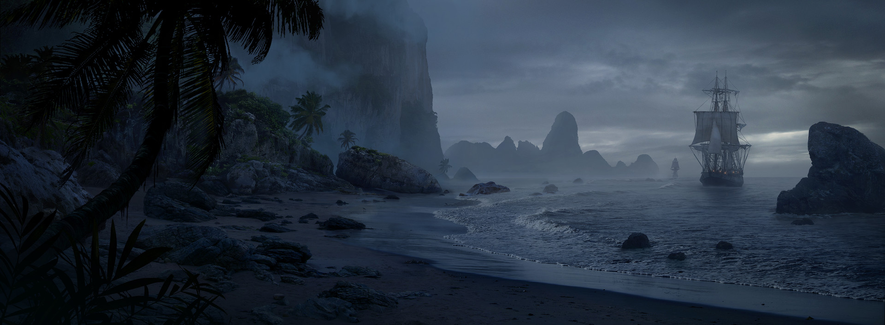

# Cave & Rock

## [ArtStation - 24h Speed Environment, Robert Berg](https://www.artstation.com/artwork/z30yQ)

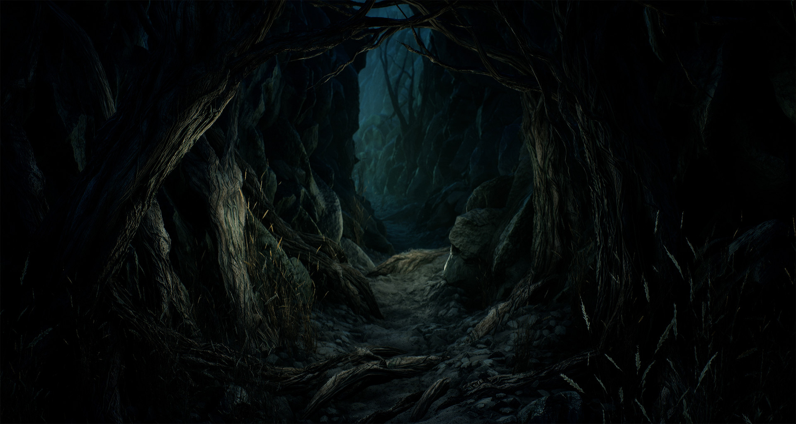

## [ArtStation - Mystical Woods, Ferdinand Ladera](https://www.artstation.com/artwork/bgO2m)

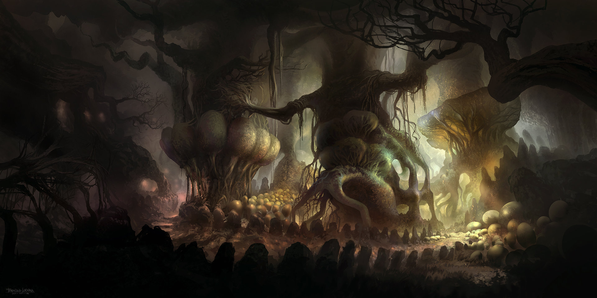

